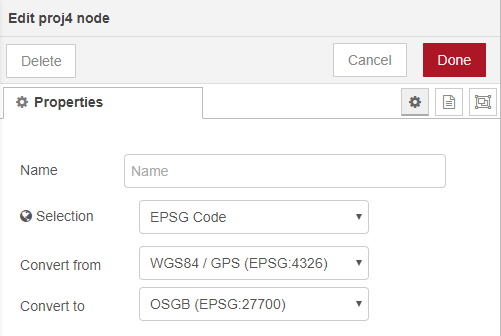
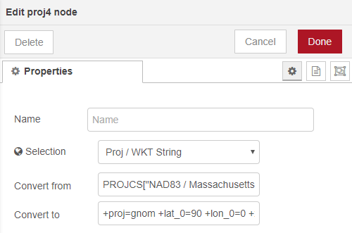
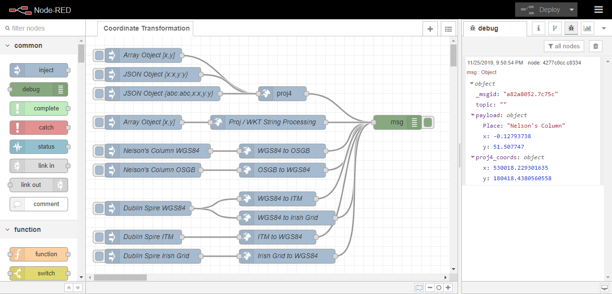

# node-red-contrib-proj4
A [Node-Red](https://nodered.org/) node for performing conversions between different geographic [coordinate reference systems](https://en.wikipedia.org/wiki/Spatial_reference_system) (CRS) based on the [Proj4js JavaScript](http://proj4js.org/) library.

## Purpose
This node is primarily intended for converting between coordinates provided in global coordinate reference systems such as [World Geodetic System (WGS84)](https://en.wikipedia.org/wiki/World_Geodetic_System) which is used by GPS, or [WGS84 Psuedo-Mercator](https://en.wikipedia.org/wiki/Web_Mercator_projection) which is commonly used by web mapping platforms, and the local coordinate systems maintained by national mapping agencies to ensure optimal accuracy for applications in civil engineering and construction.

## Usage
The user specifies a coordinate reference system to 'Convert from', and a second to 'Convert to'. When the node receives a payload with coordinates in an accepted format it will transform the values from the first CRS to the second.

The user first chooses a method for specifiying the two CRSs to use in the conversion. Selecting 'EPSG Codes' provides prepopulated dropdown lists. 

Alternatively users can select 'Proj / WKT string' in order to input the relevant [proj-strings](https://proj.org/usage/quickstart.html) or [well-known text](https://en.wikipedia.org/wiki/Well-known_text_representation_of_coordinate_reference_systems) (WKT) representations as found on [epsg.io](http://epsg.io/) or [spatialreference.org](https://spatialreference.org/).

These strings can also be overridden by setting `msg.firstCRS` and/or `msg.secondCRS` to your preferred CRS strings in the message. 

As with proj4.js library, coordinates can be provided as an object of the form `{x:x,y:y}` or an array of the form `[x,y]`. Additionally the node will parse the incoming message payload for coordinates identified by one of the following combinations of payload properties:
- x,y: `msg.payload.x` and `msg.payload.y`
- lat,lon: `msg.payload.lon` and `msg.payload.lat`
- latitude,longitude: `msg.payload.longitude` and `msg.payload.latitude`
- eastings,northings: `msg.payload.eastings` and `msg.payload.northings`
- GeoJSON: `msg.payload` as a GeoJSON FeatureCollection, optionally set `msg.payload.features` as an array of GeoJSON Features.

When inputting GeoJSON, the node will transform all the coordinates found in the `features` array, keeping any other feature properties intact. 

NOTE 1: GeoJSON only officially supports WGS84 / GPS (ESPG:4326), so if you want to be fully GeoJSON compliant you should use that as your target CRS.  

NOTE 2: As an effect of only transforming point coordinates, very big features (e.g. lines spanning a significant part of the globe) may be distorted by the transformation. While all coordinate points will be transformed correctly, any lines connected between them may not be exactly preserved. A "straight line" in one coordinate system might not be straight in another - But GeoJSON lines will be expressed as straight lines in the new coordinate system as well.

Results will be returned on the msg.proj4_coords in the same format as they were received, either an object of the form `{x:x,y:y}`, as an array of the form `[x,y]`, or (in the case of GeoJSON) as a GeoJSON object on msg.payload.

## Example File
An example file has been provided which demonstrates common usage of the node. Access the example by navigating to the Node-Red editor's menu and selecting **Export > Examples > node-red-contrib-proj4 > Coordinate Transformation**.

## Supported Coordinate Reference Systems
Currently the Proj4 node has presets for the following coordinate systems:
- OSGB (EPSG:27700)
- ITM (EPSG:2157)
- Irish Grid (EPSG:29903)
- NAD83 (EPSG:4269)
- WGS84 / GPS (EPSG:4326)
- WGS84 / Psuedo-Mercator (EPSG:3857)

Further details of different coordinate reference systems can be found on [epsg.io](https://epsg.io/).

## Further Development 
If you are interested in suggesting enhancements please raise an issue for review via [GitHub](https://github.com/virtualarchitectures/node-red-contrib-proj4). 
